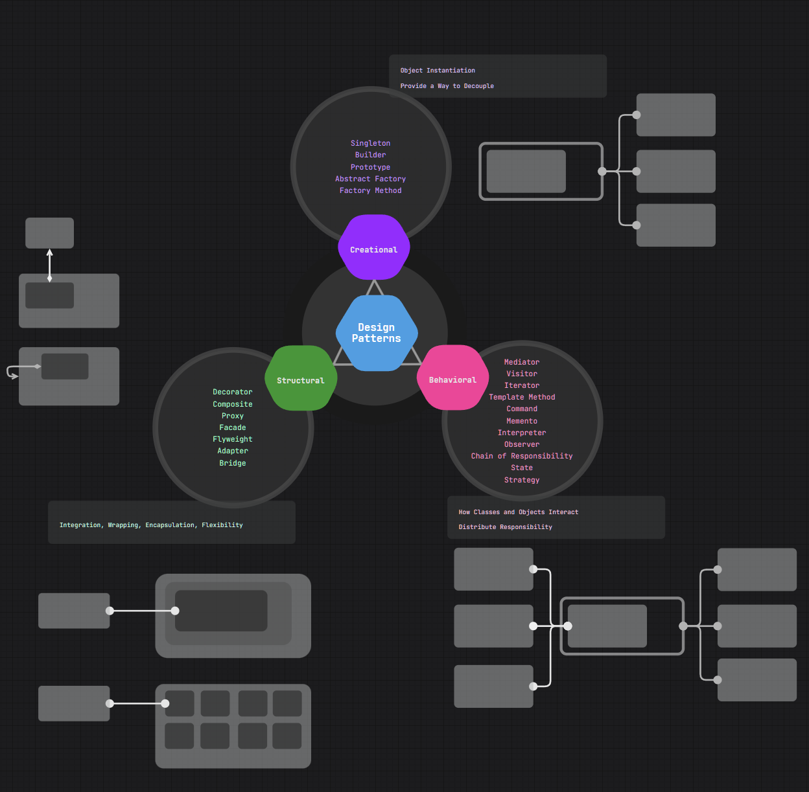
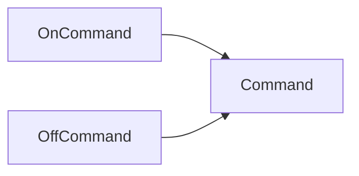
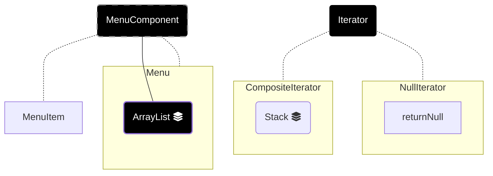
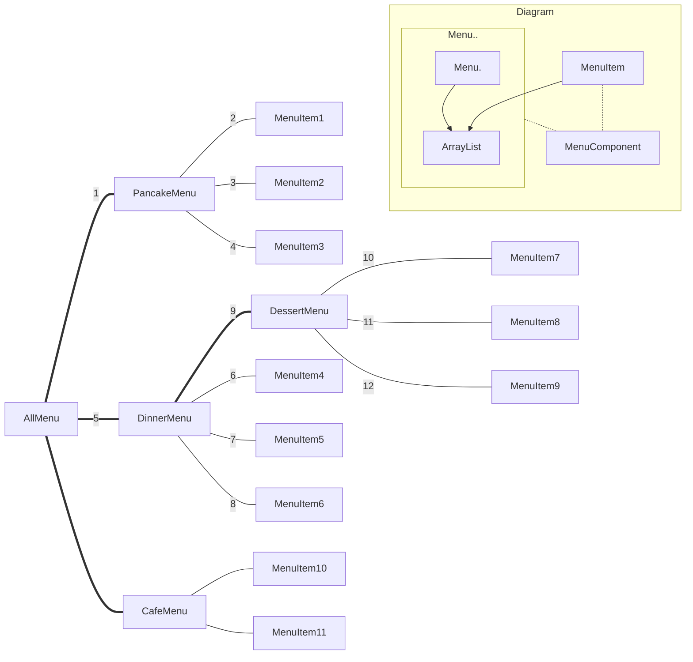
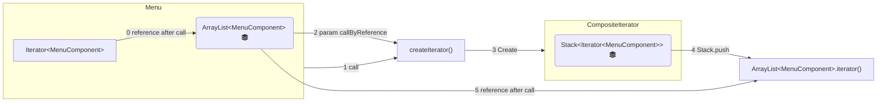

# Design Patterns
Design Patternsは\
Object-oriented programming (OOP) Languages\
Java, C#, C++, Swift, JavaScript, Python
などの現在の言語で、アプリを効率的に設計できる方法です。

Procedure Languages\
C, Python, Javascriptの一部で、\
関数だけで作る事ができる言語とは異なる新しいObject-Class概念で設計する方法を提供しています。


GIMP => C
Embed, Kernel, System, Core => C

言語の一般的な原理は似ているので色々な言語の一つを選択して応用できます。\
Design Patternsは\
API, SDK, Common Libraryやゲームなどの様々な種類のアプリで\
活用できます。

こちらにはJAVAで説明します。


Java Design Patterns を参考にして\
C++, Python, JavaScript, SwiftなどのOOP言語に応用できるように\
説明していきたいと思います。


# INDEX



1. A Strategy Pattern
2. B Observer Pattern
3. C Decorator Pattern
4. D Factory Pattern – Abstract Factory, Factory Method
5. E Singleton Pattern
6. F Command Pattern
7. G Adapter and Facade Pattern
8. H Template Method Pattern
9. I Iterator and Composite Pattern
10. J State Pattern
11. K Proxy Pattern
12. L Compound Pattern
13. L MVC Pattern

14. Builder
15. Prototype
16. Bridge
17. Flyweight
18. Interpreter
19. Chain of responsibility
20. Mediator
21. Memento
22. Visitor


23. Event, Delegate, Callback, Chain, ramda, reflection
24. Interface

グループしてみたら以下のような構造になります。


## 1. Strategy Pattern
#### Interfaceとabstract classの違い
* 子クラスとして承継しなくては使用できない。
* 一つしか承継できない。
* Encapsulated　Behaviour

```java
Duck mallard = new Duck();//(X)
Duck mallard = new MallardDuck();//(O)
```
#### abstract function
・必ず子クラスとして承継して関数部分を実装して呼びます。

```java
abstract void display(){System.out.println("");}//abstract function 実装しない(X)


interface Behaviour{
    int variableInt = 0; //変換しない(X)
    void display(){System.out.println("");}//interface class function 実装しない(X)
}
void display(){System.out.println("");}//(X)

```

#### interface function

## 2. Observer Pattern

## 3. Decorator Pattern

## 4. Factory Pattern
・左側の親オブジェクトタイプは親の関数を使う
・左側の子オブジェクトタイプは子の関数を使う
```java

```
・親オブジェクトにだけある関数によって呼ばれても、子オブジェクトタイプなら、子の関数が呼ばれます。
　CaffeineBeverageWithHook


#### Factory MethodとAbstrct Factoryの違い
PizzaIngredientFactory =>　Abstract Factory
createMethod() => Factory Method
```java
public abstract class PizzaStore {
    //Factory Method
    protected abstract Pizza createPizza(String item);
    public Pizza orderPizza(String type) {
        Pizza pizza = createPizza(type);
        System.out.println("--- Making a " + pizza.getName() + " ---");
        pizza.prepare();
        pizza.bake();
        return pizza;
    }
}
//Abstract Factory
/*
 * PizzaIngredientFactory is implemented as an
 * Abstract Factory because we need to create families
 * of products(the ingredients)
 * 
 * */
public interface PizzaIngredientFactory {
    //Factory Method
    public Dough createDough();
    public Sauce createSauce();

}
public class NYPizzaIngredientFactory implements PizzaIngredientFactory {

    public Dough createDough() {
        return new ThinCrustDough();
    }
}
```


## 5. Singleton Pattern

```java
public class Singleton {
	private static Singleton uniqueInstance;
 
	// other useful instance variables here
 
	private Singleton() {}
 
	public static Singleton getInstance() {
		if (uniqueInstance == null) {
			uniqueInstance = new Singleton();
		}
		return uniqueInstance;
	}
 
	// other useful methods here
}

```

## 6. Command Pattern

## 7. Adapter and Facade Pattern
## 8. Template Method Pattern!
## 9. Iterator and Composite Pattern
```java
userIterator.hasNext();
userIterator.next();
```
9-1. IteratorManualArrayAndList\
9-2. IteratorArrayList\
9-3. IteratorStack\
9-4. IteratorEnumeration\
9-5. IteratorStringCollection\
9-6. IteratorCollection

[Interface Iterator]は配列を探索するために必要な関数があります。\
[Interface Menu]は配列を探索するIteratorを食事のメニューで実装したクラスを生成する関数があります。\
[MenuItem]は名前、値段、メニューの説明などの変数があります。

### 9-6. IteratorCollection
```java
public class Collections {
	public static void main (String args[]) {		
		Vector<String> v = new Vector<String>(Arrays.asList(args));
		
		System.out.println("Using enumeration with Vector");
		Enumeration<String> enumeration = v.elements();
		while (enumeration.hasMoreElements()) {
			System.out.println(enumeration.nextElement());
		}
		
		System.out.println("Using iterator with Vector");
		Iterator<String> iterator = (Iterator<String>) v.iterator();
		while (iterator.hasNext()) {
			System.out.println(iterator.next());
		}
		
		System.out.println("Using for/in with array of Strings");
		for (String color : args) {
			System.out.println(color);
		}

	}
}

```

MenuはMenuItemがリストに入っています。\
MenuItemは一つの食事のメニューを表しています。

MenuならStackにArrayListのIteratorの機能を入れます。\

<head>
<link
  href="https://cdnjs.cloudflare.com/ajax/libs/font-awesome/6.5.1/css/all.min.css"
  rel="stylesheet"
/>
</head>

### 9-3. IteratorStack


MenuComponent
```java
public abstract class MenuComponent {

    public void add(MenuComponent menuComponent) {
        throw new UnsupportedOperationException();
    }
    public void remove(MenuComponent menuComponent) {
        throw new UnsupportedOperationException();
    }
    public MenuComponent getChild(int i) {
        throw new UnsupportedOperationException();
    }

    public String getName() {
        throw new UnsupportedOperationException();
    }
    public String getDescription() {
        throw new UnsupportedOperationException();
    }
    public double getPrice() {
        throw new UnsupportedOperationException();
    }
    public boolean isVegetarian() {
        throw new UnsupportedOperationException();
    }

    public abstract Iterator createIterator();

    public void print() {
        throw new UnsupportedOperationException();
    }

    public void printV(){
        throw new UnsupportedOperationException();
    }


}
```
MenuItem
```java


public class MenuItem extends MenuComponent {

    String name;
    String description;
    boolean vegetarian;
    double price;

    public MenuItem(String name,
                    String description,
                    boolean vegetarian,
                    double price)
    {
        this.name = name;
        this.description = description;
        this.vegetarian = vegetarian;
        this.price = price;
    }

    public String getName() {
        return name;
    }

    public String getDescription() {
        return description;
    }

    public double getPrice() {
        return price;
    }

    public boolean isVegetarian() {
        return vegetarian;
    }

    public Iterator<MenuComponent> createIterator() {
        return new NullIterator();
    }

    public void print() {
        System.out.print("  " + getName());
        if (isVegetarian()) {
            System.out.print("(v)");
        }
        System.out.println(", " + getPrice());
        System.out.println("     -- " + getDescription());
    }

}
```
Menu
```java


public class Menu extends MenuComponent {
    Iterator<MenuComponent> iterator = null;
    ArrayList<MenuComponent> menuComponents = new ArrayList<MenuComponent>();
    String name;
    String description;

    public Menu(String name, String description) {
        this.name = name;
        this.description = description;
    }

    public void add(MenuComponent menuComponent) {
        menuComponents.add(menuComponent);
    }

    public void remove(MenuComponent menuComponent) {
        menuComponents.remove(menuComponent);
    }

    public MenuComponent getChild(int i) {
        return menuComponents.get(i);
    }

    public String getName() {
        return name;
    }

    public String getDescription() {
        return description;
    }


    public Iterator<MenuComponent> createIterator() {
        if (iterator == null) {
            iterator = new CompositeIterator(menuComponents.iterator());
        }
        return iterator;
    }


    public void print() {
        System.out.print("\n" + getName());
        System.out.println(", " + getDescription());
        System.out.println("---------------------");

        Iterator<MenuComponent> iterator = menuComponents.iterator();
        //ArrayList Collectionで基本的に提供している[List iterator]
        while (iterator.hasNext()) { //ArrayListのhasNext();
            MenuComponent menuComponent = iterator.next();//ArrayListの次にあるオブジェクトを返える。
            //黙示的に次第に移動する
            menuComponent.print();
        }
    }
}
```
CompositeIterator
```java
public class CompositeIterator implements Iterator {
    Stack<Iterator<MenuComponent>> stack = new Stack<Iterator<MenuComponent>>();

    public CompositeIterator(Iterator<MenuComponent> iterator) {
        stack.push(iterator);
    }

    public MenuComponent next() {
        if (hasNext()) {
            Iterator<MenuComponent> iterator = stack.peek();
            MenuComponent component = iterator.next();
            stack.push(component.createIterator());
            return component;
        } else {
            return null;
        }
    }

    public boolean hasNext() {
        if (stack.empty()) {
            return false;
        } else {
            Iterator<MenuComponent> iterator = stack.peek();
            if (!iterator.hasNext()) {
                stack.pop();
                return hasNext();
            } else {
                return true;
            }
        }
    }
}
```
```java
public class Waitress {
    MenuComponent allMenus;

    public Waitress(MenuComponent allMenus) {
        this.allMenus = allMenus;
    }

    public void printMenu() {
        allMenus.print();
    }

    public void printVegetarianMenu() {
        Iterator<MenuComponent> iterator = allMenus.createIterator();

        System.out.println("\nVEGETARIAN MENU\n----");
        while (iterator.hasNext()) {
            MenuComponent menuComponent = iterator.next();
            try {
                if (menuComponent.isVegetarian()) {
                    menuComponent.print();
                }
            } catch (UnsupportedOperationException e) {}
        }
    }
}
```
Drive
```java
public static void main(String args[]){
    MenuComponent pancakeHouseMenu = new Menu("PANCAKE HOUSE MENU", "Breakfast");
    MenuComponent dinerMenu = new Menu("DINER MENU", "Lunch");
    MenuComponent cafeMenu = new Menu("CAFE MENU", "Dinner");
    MenuComponent dessertMenu = new Menu("DESSERT MENU", "Dessert of course!");
    
    MenuComponent allMenus = new Menu("ALL MENUS", "All menus combined");
		
    allMenus.add(pancakeHouseMenu);
    allMenus.add(dinerMenu);
    allMenus.add(cafeMenu);
    dinerMenu.add(dessertMenu);

    pancakeHouseMenu.add(new MenuItem("K&B's Pancake Breakfast", "Pancakes with scrambled eggs, and toast", true, 2.99));
    pancakeHouseMenu.add(new MenuItem("Regular Pancake Breakfast", "Pancakes with fried eggs, sausage", false, 2.99));
    pancakeHouseMenu.add(new MenuItem("Blueberry Pancakes", "Pancakes made with fresh blueberries, and blueberry syrup", true, 3.49));
    pancakeHouseMenu.add(new MenuItem("Waffles", "Waffles, with your choice of blueberries or strawberries", true, 3.59));

    dinerMenu.add(new MenuItem("Vegetarian BLT", "(Fakin') Bacon with lettuce & tomato on whole wheat", true, 2.99));
    dinerMenu.add(new MenuItem("BLT", "Bacon with lettuce & tomato on whole wheat", false, 2.99));
    dinerMenu.add(new MenuItem("Soup of the day", "A bowl of the soup of the day, with a side of potato salad", false, 3.29));
    dinerMenu.add(new MenuItem("Hotdog", "A hot dog, with saurkraut, relish, onions, topped with cheese", false, 3.05));
    dinerMenu.add(new MenuItem("Steamed Veggies and Brown Rice", "A medly of steamed vegetables over brown rice", true, 3.99));
    dinerMenu.add(new MenuItem("Pasta", "Spaghetti with Marinara Sauce, and a slice of sourdough bread", true, 3.89));

    cafeMenu.add(new MenuItem("Veggie Burger and Air Fries", "Veggie burger on a whole wheat bun, lettuce, tomato, and fries", true, 3.99));
    cafeMenu.add(new MenuItem("Soup of the day", "A cup of the soup of the day, with a side salad", false, 3.69));
    cafeMenu.add(new MenuItem("Burrito", "A large burrito, with whole pinto beans, salsa, guacamole", true, 4.29));

    dessertMenu.add(new MenuItem("Apple Pie", "Apple pie with a flakey crust, topped with vanilla icecream", true, 1.59));
    dessertMenu.add(new MenuItem("Cheesecake", "Creamy New York cheesecake, with a chocolate graham crust", true, 1.99));
    dessertMenu.add(new MenuItem("Sorbet", "A scoop of raspberry and a scoop of lime", true, 1.89));

    Waitress waitress = new Waitress(allMenus);

    waitress.printVegetarianMenu();
    waitress.printMenu();
}

```

Decorator PatternのようにArrayListを利用してTREEを探索します。\
Stackを利用してTREEを探索します。\

Menuは自分自身を配列として持っているので\
Decorator Patternのように処理します。\
print()関数の呼び出しはDecorator PatternのgetDescription(), getCost()のような関数の呼び出しです。

Menuのprint()はnext()を呼び出します。
MenuItemのprint()はnext()を呼び出す事はありません。
同じ関数だけでの依存関係を成立させます。



Stack


**Iterator**< MenuComponent > iterator2 = null;\
iterator2 = new NewIterator();\
class NewIterator implements **Iterator**\
Iterator<MenuComponent>で指定されても\
Iteratorで実装されているNewIteratorなら、挿入できます。


## 10. State Pattern
```java
```
## 11. Proxy Pattern
## 12. Compound Pattern
## 13. Etc(MVC) Pattern

## 14. Builder
## 15. Prototype
## 16. Bridge
## 17. Flyweight
## 18. Interpreter
## 19. Chain of responsibility
## 20. Mediator
## 21. Memento
## 22. Visitor


# HeadFirstJDP
### 1章　デザインパターンへようこそ：デザインパターン入門

それは簡単なSimUDuckアプリから始まった\
しかし、カモが「飛ぶ」ようにする必要が出てきてしまった\
しかし、事態はひどく悪い方向に進む\
継承について考えるジョー\
インタフェースはどうか？\
あなたがジョーの立場ならどうする？\
ソフトウェア開発における1つの変わらぬもの\
問題に照準を合わせる\
不変な部分から変化する部分を分離する\
カモの振る舞いを設計する\
カモの振る舞いを実装する\
カモの振る舞いを統合する\
Duckコードをテストする\
振る舞いを動的に設定する\
カプセル化された振る舞いの全体像\
「HAS-A」は「IS-A」より優れている場合がある\
デザインパターンのことを話そう\
地元のレストランでふと耳にしたこと\
オフィスの隣の席でふと耳にしたこと\
共有パターンボキャブラリの威力\
どうやってデザインパターンを使うの？\
デザインツールボックスのためのツール\

### 2章　オブジェクトを事情通に：Observerパターン
気象観測アプリケーションの概要\
Observerパターンとの出会い\
パブリッシャ＋サブスクライバ＝Observerパターン\
Observerパターンの定義\
疎結合の威力\
気象観測所を設計する\
気象観測所を実装する\
気象観測所の機能を強化する\
世の中のObserverパターンを調べる\
人生を変えるアプリケーションのコーディング\
その頃、Weather-O-Rama社では\
新しいコードの試運転\
デザインツールボックスのためのツール\
設計原則に挑戦\

### 3章　オブジェクトの装飾：Decoratorパターン
スターバズコーヒーへようこそ\
開放/閉鎖原則（Open-Closed Principle）\
Decoratorパターンとの出会い\
デコレータを使って飲み物注文システムを構築する\
Decoratorパターンの定義\
飲み物を装飾する\
スターバズのコードを書く\
飲み物をコーディングする\
コンディメントをコーディングする\
コーヒーを提供する\
実世界のデコレータ：Java I/O\
java.ioクラスの装飾\
独自のJava I/Oデコレータを書く\
新しいJava I/Oデコレータのテスト\
デザインツールボックスのためのツール\

### 4章　OOの利点を活用した構築：Factoryパターン\
変化する部分を特定する\
オブジェクト作成をカプセル化する\
簡単なピザファクトリを構築する\
Simple Factoryの定義\
ピザ店用のフレームワーク\
サブクラスに決定させる\
ファクトリメソッドを宣言する\
ついにFactory Methodパターンに対面するときが来た\
作成者と製品を並列にとらえる\
Factory Methodパターンの定義\
オブジェクトの依存関係を考察する\
依存関係反転の原則\
原則を適用する\
一連の食材\
食材ファクトリを構築する\
ピザの改良\
ピザ店を再び訪れる\
これまでに実行したこと\
Abstract Factoryパターンの定義\
Factory MethodとAbstract Factoryの比較\
デザインツールボックスのためのツール\
\
### 5章　唯一のオブジェクト：Singletonパターン\
典型的なSingletonパターンの実装を分析する\
チョコレート工場\
Singletonパターンの定義\
ヒューストンハーシー、問題が発生しました\
マルチスレッドを扱う\
マルチスレッドを改善できるか？\
チョコレート工場に戻ると…\
デザインツールボックスのためのツール\
\
### 6章　呼び出しのカプセル化：Commandパターン\
Home Automation or Bust社\
ベンダーのクラスを調べる\
Commandパターンを簡単に紹介\
食堂からCommandパターンへ\
最初のコマンドオブジェクト\
コマンドオブジェクトを使用する\
コマンドをスロットに割り当てる\
リモコンを実装する\
コマンドを実装する\
リモコンをテストする\
マニュアルを書く\
何を行うの？\
アンドゥボタンのテストを行う！\
状態を使ってアンドゥを実装する\
シーリングファンのコマンドにアンドゥを追加する\
リモコンにはパーティモードが必要！\
マクロコマンドを使う\
Commandパターンのその他の使用法：リクエストのキュー\
Commandパターンのその他の使用法：リクエストのログ記録\
現実世界でのコマンドパターン\
デザインツールボックスのためのツール\
エクササイズの答え\

### 7章　適合可能にする：AdapterパターンとFacadeパターン\
身の回りのアダプタ\
オブジェクト指向アダプタ\
カモのように歩き、カモのようにガーガー鳴くものがいたら、それはカモに違いないカモアダプタでラップされた七面鳥かもしれない\
アダプタのテスト\
Adapterパターンの説明\
Adapterパターンの定義\
オブジェクトアダプタとクラスアダプタ\
実世界のアダプタ\
Enumeration をIteratorに適合させる\
スイートホームシアター\
映画を観る（難しい方法）\
照明、カメラ、ファサード！\
ホームシアターファサードを構築する\
単純化されたインタフェースを実装する\
映画を観る（簡単な方法）\
Facadeパターンの定義\
最小知識の原則（Principle of Least Knowledge）\
友達を作らずオブジェクトに影響を与えない方法\
Facadeパターンと最小知識の原則\
デザインツールボックスのためのツール\
\
### 8章　アルゴリズムのカプセル化：Template Methodパターン\
そろそろカフェインが欲しい\
（Javaで）コーヒークラスと紅茶クラスを作る\
CoffeeとTeaを抽象化しよう\
さらに設計を進める\
prepareRecipe()を抽象化する\
何を行ったの？\
Template Methodとの出会い\
テンプレートメソッドで何が得られた？\
Template Methodパターンの定義\
テンプレートメソッドをフックする\
フックを使う\
ハリウッドの原則とテンプレートメソッド\
実際のテンプレートメソッド\
テンプレートメソッドを使ってソートする\
ソートすべきカモがいる\
compareTo()とは？\
Duckを比較する\
Duckをソートしてみよう\
カモソートマシンの作成\
フレームでスイング\
AbstractListを使った独自のリスト\
デザインツールボックスのためのツール\

### 9章　適切に管理されたコレクション：IteratorパターンとCompositeパターン\
速報：オブジェクト町食堂とオブジェクト町パンケーキハウスの合併\
メニューの項目を調べる\
仕様の実装：最初の試み\
反復処理をカプセル化できる？\
Iteratorパターンとの出会い\
DinerMenuにイテレータを追加する\
イテレータを使ってDinerMenuを書き直す\
ウェイトレスのコードを修正する\
コードをテストする\
現在の設計を見直す\
java.util.Iteratorを使って整理する\
Iteratorパターンの定義\
Iteratorパターンの構造\
単一責務の原則\
JavaのIterableインタフェースとの出会い\
Javaの拡張forループ\
カフェのメニューを調べる\
イテレータとコレクション\
ウェイトレスの準備は整った？\
Compositeパターンの定義\
Compositeを使ってメニューを設計する\
MenuComponentを実装する\
MenuItemを実装する\
コンポジットメニューを実装する\
いよいよ試運転\
デザインツールボックスのためのツール\

### 10章　物事の状態：Stateパターン\
Javaによる成功\
状態マシンの基礎\
コードを書く\
社内でのテスト\
やっぱり来た、変更要求！\
面倒な「状態」\
新しい設計\
StateインタフェースとStateクラスを定義する\
ガムボールマシンを書き直す\
完全なGumballMachineクラスを確認しよう\
その他の状態を実装する\
Stateパターンの定義\
まだ10回に1回「当たり」があるガムボールのゲームを完成させる必要がある\
ゲームを仕上げる\
Mighty Gumball社のCEOへのデモ\
健全性チェック\
危うく忘れるところだった！\
デザインツールボックスのためのツール\

### 11章　オブジェクトアクセスの制御：Proxyパターン\
モニターのコーディング\
モニターのテスト\
リモートメソッドの基礎\
ガムボールマシンをリモートサービスにする準備をする\
RMIレジストリに登録する\
Proxyパターンの定義\
仮想プロキシに備える\
アルバムジャケット仮想プロキシの設計\
画像プロキシの作成\
Java APIのProxyを使って保護プロキシを作成する\
オブジェクト町のギークの出会い支援サービス\
Person実装\
5分間ドラマ：サブジェクト（主体）の保護\
全体像：Person用の動的プロキシの作成\
プロキシ動物園\
デザインツールボックスのためのツール\
アルバムジャケットビューアのコード\

### 12章　パターンのパターン：Compoundパターン\
連携する\
カモとの再会\
何をしたの？\
（鳥）「カモ」瞰図：クラス図\
Compoundパターンの王様\
MVC（モデル/ ビュー/ コントローラ）との出会い\
詳しく調べる\
MVCをパターンの集まりとして理解する\
MVCを使ってビートを制御する\
構成要素を構築する\
次に具象BeatModelクラスを調べよう\
ビュー\
ビューを実装する\
次はコントローラ\
すべてをまとめる\
Strategyパターンを探究する\
モデルを適合させる\
次はテストの実行\
デザインツールボックスのためのツール\

### 13章　実世界でのパターン：パターンの有効利用\
デザインパターンの定義\
デザインパターンの定義についてさらに詳しく調べる\
フォースと共にあらんことを\
デザインパターンの作者になるには\
デザインパターンを体系化する\
パターンで考える\
パターンに対する心\
共有ボキャブラリの威力を忘れない\
「ギャング・オブ・フォー」とオブジェクト町を巡る\
旅はまだ始まったばかり\
パターン動物園\
アンチパターンの弊害を撲滅する\
デザインツールボックスのためのツール\
オブジェクト町を去る\

### 14章　付録：残りのパターン\
Bridgeパターン\
Builderパターン\
Chain of Responsibilityパターン\
Flyweightパターン\
Interpreterパターン\
Mediatorパターン\
Mementoパターン\
Prototypeパターン\
Visitorパターン\
