### Defining
MenuはMenuItemがリストに入っています。\
MenuItemは一つの食事のメニューを表しています。

MenuならStackにArrayListのIteratorの機能を入れます。\


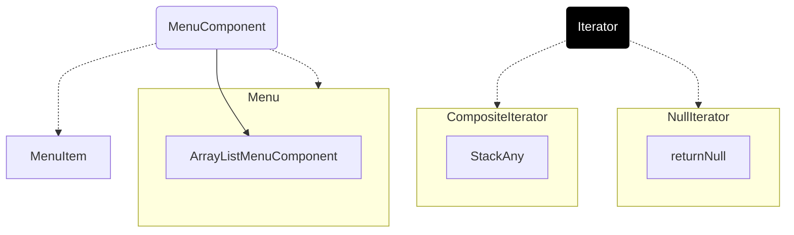

```java
import com.jdpattern.composite.menuiterator.CompositeIterator;
import com.jdpattern.composite.menuiterator.NullIterator;

public abstract class MenuComponent {
    public abstract Iterator createIterator();
}

public class MenuItem extends MenuComponent {
    public Iterator createIterator() {
        new NullIterator();
    }
}
public class Menu extends MenuComponent {
    ArrayList menuComponents = new ArrayList();
    public Iterator createIterator() {
        new CompositeIterator(menuComponents.iterator());
    }
}
```

```java
public class CompositeIterator implements Iterator {
    Stack stack = new Stack();

    public CompositeIterator(Iterator iterator) {
        stack.push(iterator); //menuComponent.iterator()
    }

    public Object next() {
        if (hasNext()) {
            Iterator iterator = (Iterator) stack.peek(); //allmenu menuComponent.iterator() -> pancake CompositeIterator
            MenuComponent component = (MenuComponent) iterator.next(); //allmenu menuComponent.iterator() -> pancake CompositeIterator -> pancake menuComponent.iterator()
            System.out.println(component.getName()); //
            if (component instanceof Menu) {
                stack.push(component.createIterator()); //CompositeIterator
            }
            return component;
        } else {
            return null;
        }
    }

    public boolean hasNext() {
        if (stack.empty()) {
            return false;
        } else {
            System.out.println("1");
            Iterator iterator = (Iterator) stack.peek(); //menuComponents.iterator() allmenu -> pancake CompositeIterator -> pancake menuComponent.iterator()
            if (!iterator.hasNext()) { //메뉴가 없으면
                stack.pop();
                return hasNext();
            } else {
                return true;
            }
        }
    }

    public void remove() {
        throw new UnsupportedOperationException();
    }
}
```

\
\
\

### Linking

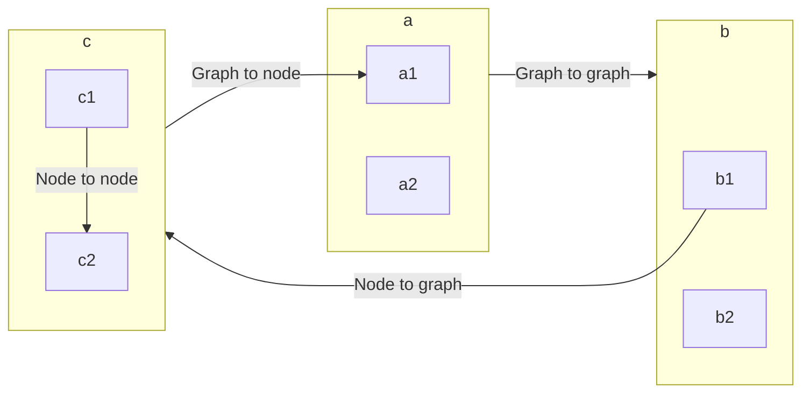

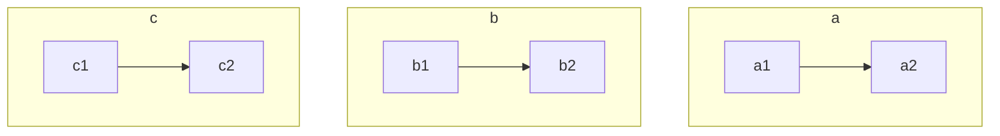

# State diagrams cheatsheet

[Official documentation](https://mermaid-js.github.io/mermaid/#/stateDiagram) & [live editor](https://mermaid-js.github.io/mermaid-live-editor/#/edit/eyJjb2RlIjoic3RhdGVEaWFncmFtLXYyXG4gICAgWypdIC0tPiBTdGlsbFxuICAgIFN0aWxsIC0tPiBbKl1cbiAgICBTdGlsbCAtLT4gTW92aW5nXG4gICAgTW92aW5nIC0tPiBTdGlsbFxuICAgIE1vdmluZyAtLT4gQ3Jhc2hcbiAgICBDcmFzaCAtLT4gWypdIiwibWVybWFpZCI6eyJ0aGVtZSI6ImRlZmF1bHQiLCJ0aGVtZVZhcmlhYmxlcyI6eyJiYWNrZ3JvdW5kIjoid2hpdGUiLCJwcmltYXJ5Q29sb3IiOiIjRUNFQ0ZGIiwic2Vjb25kYXJ5Q29sb3IiOiIjZmZmZmRlIiwidGVydGlhcnlDb2xvciI6ImhzbCg4MCwgMTAwJSwgOTYuMjc0NTA5ODAzOSUpIiwicHJpbWFyeUJvcmRlckNvbG9yIjoiaHNsKDI0MCwgNjAlLCA4Ni4yNzQ1MDk4MDM5JSkiLCJzZWNvbmRhcnlCb3JkZXJDb2xvciI6ImhzbCg2MCwgNjAlLCA4My41Mjk0MTE3NjQ3JSkiLCJ0ZXJ0aWFyeUJvcmRlckNvbG9yIjoiaHNsKDgwLCA2MCUsIDg2LjI3NDUwOTgwMzklKSIsInByaW1hcnlUZXh0Q29sb3IiOiIjMTMxMzAwIiwic2Vjb25kYXJ5VGV4dENvbG9yIjoiIzAwMDAyMSIsInRlcnRpYXJ5VGV4dENvbG9yIjoicmdiKDkuNTAwMDAwMDAwMSwgOS41MDAwMDAwMDAxLCA5LjUwMDAwMDAwMDEpIiwibGluZUNvbG9yIjoiIzMzMzMzMyIsInRleHRDb2xvciI6IiMzMzMiLCJtYWluQmtnIjoiI0VDRUNGRiIsInNlY29uZEJrZyI6IiNmZmZmZGUiLCJib3JkZXIxIjoiIzkzNzBEQiIsImJvcmRlcjIiOiIjYWFhYTMzIiwiYXJyb3doZWFkQ29sb3IiOiIjMzMzMzMzIiwiZm9udEZhbWlseSI6IlwidHJlYnVjaGV0IG1zXCIsIHZlcmRhbmEsIGFyaWFsIiwiZm9udFNpemUiOiIxNnB4IiwibGFiZWxCYWNrZ3JvdW5kIjoiI2U4ZThlOCIsIm5vZGVCa2ciOiIjRUNFQ0ZGIiwibm9kZUJvcmRlciI6IiM5MzcwREIiLCJjbHVzdGVyQmtnIjoiI2ZmZmZkZSIsImNsdXN0ZXJCb3JkZXIiOiIjYWFhYTMzIiwiZGVmYXVsdExpbmtDb2xvciI6IiMzMzMzMzMiLCJ0aXRsZUNvbG9yIjoiIzMzMyIsImVkZ2VMYWJlbEJhY2tncm91bmQiOiIjZThlOGU4IiwiYWN0b3JCb3JkZXIiOiJoc2woMjU5LjYyNjE2ODIyNDMsIDU5Ljc3NjUzNjMxMjglLCA4Ny45MDE5NjA3ODQzJSkiLCJhY3RvckJrZyI6IiNFQ0VDRkYiLCJhY3RvclRleHRDb2xvciI6ImJsYWNrIiwiYWN0b3JMaW5lQ29sb3IiOiJncmV5Iiwic2lnbmFsQ29sb3IiOiIjMzMzIiwic2lnbmFsVGV4dENvbG9yIjoiIzMzMyIsImxhYmVsQm94QmtnQ29sb3IiOiIjRUNFQ0ZGIiwibGFiZWxCb3hCb3JkZXJDb2xvciI6ImhzbCgyNTkuNjI2MTY4MjI0MywgNTkuNzc2NTM2MzEyOCUsIDg3LjkwMTk2MDc4NDMlKSIsImxhYmVsVGV4dENvbG9yIjoiYmxhY2siLCJsb29wVGV4dENvbG9yIjoiYmxhY2siLCJub3RlQm9yZGVyQ29sb3IiOiIjYWFhYTMzIiwibm90ZUJrZ0NvbG9yIjoiI2ZmZjVhZCIsIm5vdGVUZXh0Q29sb3IiOiJibGFjayIsImFjdGl2YXRpb25Cb3JkZXJDb2xvciI6IiM2NjYiLCJhY3RpdmF0aW9uQmtnQ29sb3IiOiIjZjRmNGY0Iiwic2VxdWVuY2VOdW1iZXJDb2xvciI6IndoaXRlIiwic2VjdGlvbkJrZ0NvbG9yIjoicmdiYSgxMDIsIDEwMiwgMjU1LCAwLjQ5KSIsImFsdFNlY3Rpb25Ca2dDb2xvciI6IndoaXRlIiwic2VjdGlvbkJrZ0NvbG9yMiI6IiNmZmY0MDAiLCJ0YXNrQm9yZGVyQ29sb3IiOiIjNTM0ZmJjIiwidGFza0JrZ0NvbG9yIjoiIzhhOTBkZCIsInRhc2tUZXh0TGlnaHRDb2xvciI6IndoaXRlIiwidGFza1RleHRDb2xvciI6IndoaXRlIiwidGFza1RleHREYXJrQ29sb3IiOiJibGFjayIsInRhc2tUZXh0T3V0c2lkZUNvbG9yIjoiYmxhY2siLCJ0YXNrVGV4dENsaWNrYWJsZUNvbG9yIjoiIzAwMzE2MyIsImFjdGl2ZVRhc2tCb3JkZXJDb2xvciI6IiM1MzRmYmMiLCJhY3RpdmVUYXNrQmtnQ29sb3IiOiIjYmZjN2ZmIiwiZ3JpZENvbG9yIjoibGlnaHRncmV5IiwiZG9uZVRhc2tCa2dDb2xvciI6ImxpZ2h0Z3JleSIsImRvbmVUYXNrQm9yZGVyQ29sb3IiOiJncmV5IiwiY3JpdEJvcmRlckNvbG9yIjoiI2ZmODg4OCIsImNyaXRCa2dDb2xvciI6InJlZCIsInRvZGF5TGluZUNvbG9yIjoicmVkIiwibGFiZWxDb2xvciI6ImJsYWNrIiwiZXJyb3JCa2dDb2xvciI6IiM1NTIyMjIiLCJlcnJvclRleHRDb2xvciI6IiM1NTIyMjIiLCJjbGFzc1RleHQiOiIjMTMxMzAwIiwiZmlsbFR5cGUwIjoiI0VDRUNGRiIsImZpbGxUeXBlMSI6IiNmZmZmZGUiLCJmaWxsVHlwZTIiOiJoc2woMzA0LCAxMDAlLCA5Ni4yNzQ1MDk4MDM5JSkiLCJmaWxsVHlwZTMiOiJoc2woMTI0LCAxMDAlLCA5My41Mjk0MTE3NjQ3JSkiLCJmaWxsVHlwZTQiOiJoc2woMTc2LCAxMDAlLCA5Ni4yNzQ1MDk4MDM5JSkiLCJmaWxsVHlwZTUiOiJoc2woLTQsIDEwMCUsIDkzLjUyOTQxMTc2NDclKSIsImZpbGxUeXBlNiI6ImhzbCg4LCAxMDAlLCA5Ni4yNzQ1MDk4MDM5JSkiLCJmaWxsVHlwZTciOiJoc2woMTg4LCAxMDAlLCA5My41Mjk0MTE3NjQ3JSkifX0sInVwZGF0ZUVkaXRvciI6ZmFsc2V9).

## Essentials

### Basic syntax

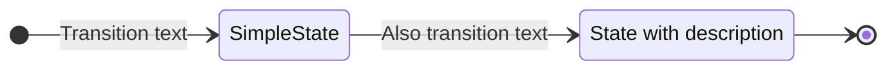

```
stateDiagram-v2
    direction LR
    s1 : State with description

    [*] --> SimpleState: Transition text
    SimpleState --> s1: Also transition text
    s1 --> [*]
```

### Direction

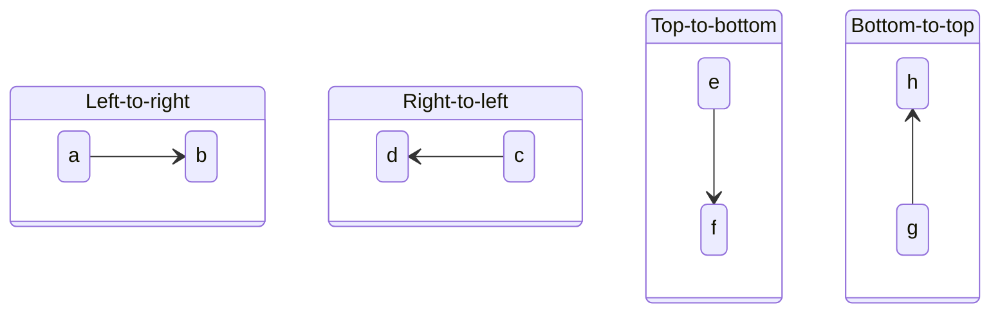

```
stateDiagram-v2
    direction TB
    state Left-to-right {
        direction LR
        a --> b
    }
    state Right-to-left {
        direction RL
        c --> d
    }
    state Top-to-bottom {
        direction TB
        e --> f
    }
    state Bottom-to-top {
        direction BT
        g --> h
    }
```

## Connecting states

### Simple

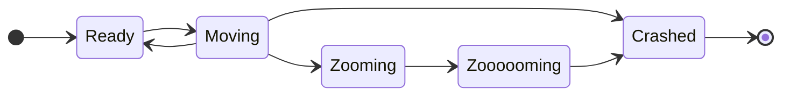

```
stateDiagram-v2
    direction LR
    [*] --> Ready
    Ready --> Moving
    Moving --> Ready
    Moving --> Zooming
    Moving --> Crashed
    Zooming --> Zoooooming
    Zoooooming --> Crashed
    Crashed --> [*]
```

### Conditional (choice)

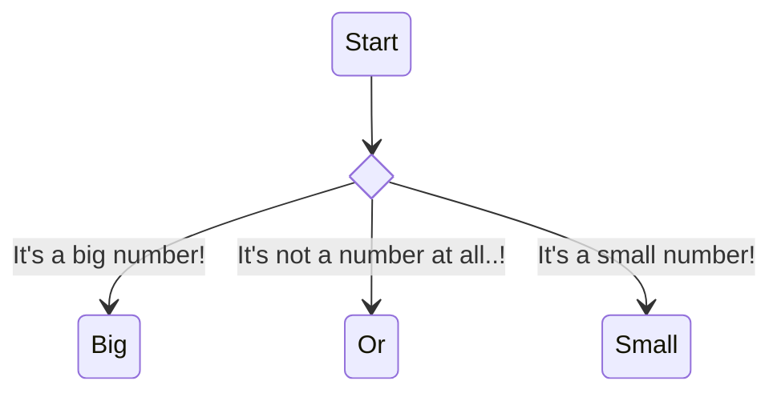

```
stateDiagram-v2
    state BigOrSmall <<choice>>
    Start --> BigOrSmall
    BigOrSmall --> Big : It's a big number!
    BigOrSmall --> Or: It's not a number at all..!
    BigOrSmall --> Small : It's a small number!
```

### Splits (fork / join)

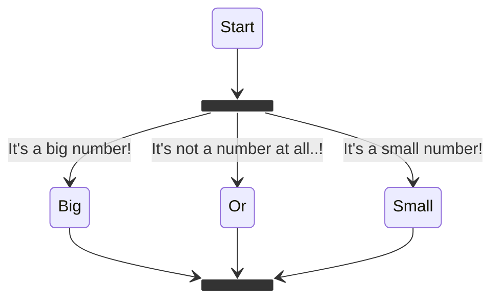

```
stateDiagram-v2
    state BigOrSmall <<fork>>
    state DoesntMatter <<join>>
    Start --> BigOrSmall
    BigOrSmall --> Big : It's a big number!
    BigOrSmall --> Or: It's not a number at all..!
    BigOrSmall --> Small : It's a small number!
    Big --> DoesntMatter
    Or --> DoesntMatter
    Small --> DoesntMatter  
```

## Subdiagrams

### Multiple state diagrams

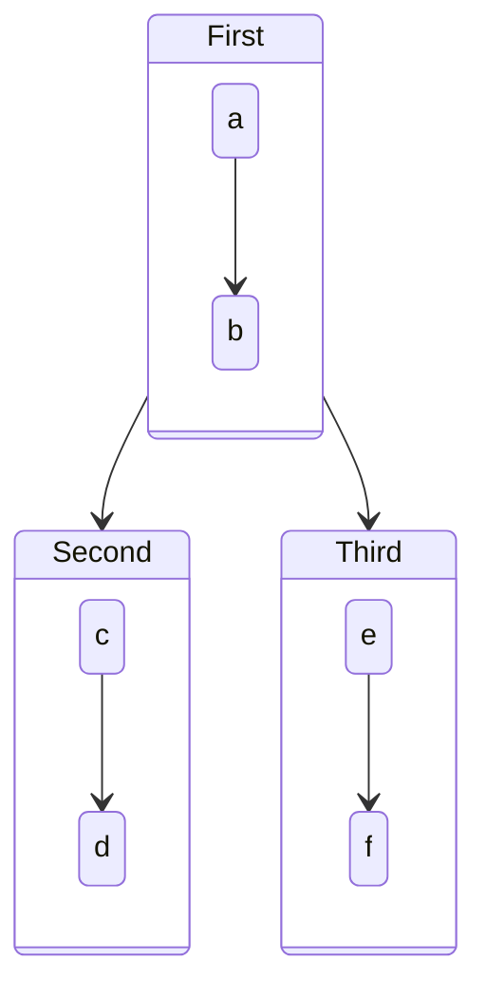

```
stateDiagram-v2
    First --> Second
    First --> Third

    state First {
        a --> b
    }
    state Second {
        c --> d
    }
    state Third {
        e --> f
    }
```

### Nested state diagrams

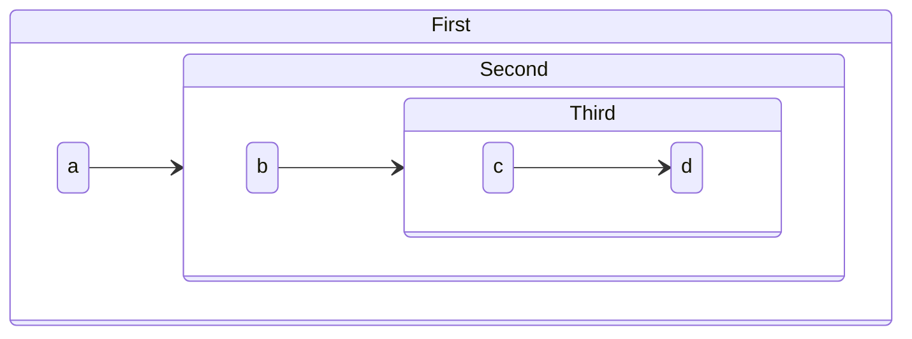

```
stateDiagram-v2

    state First {
        direction LR
        a --> Second
    }
    state Second {
        direction LR
        b --> Third
    }
    state Third {
        direction LR
        c --> d
    }
```

### Concurrency

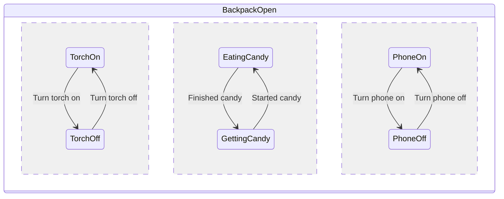

```
stateDiagram-v2

    state BackpackOpen {
        TorchOn --> TorchOff : Turn torch on
        TorchOff --> TorchOn : Turn torch off
        --
        EatingCandy --> GettingCandy : Finished candy
        GettingCandy --> EatingCandy : Started candy
        --
        PhoneOn --> PhoneOff : Turn phone on
        PhoneOff --> PhoneOn : Turn phone off
    }
```

## Other

### Notes

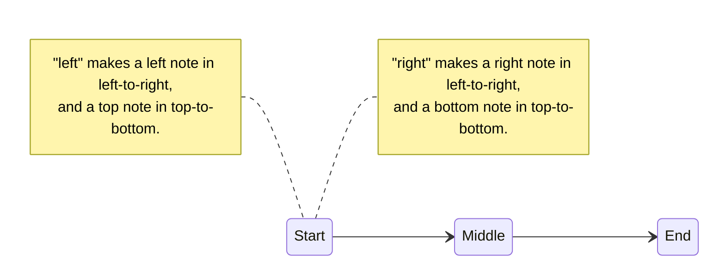

```
stateDiagram-v2
    direction LR
    Start --> Middle
    Middle --> End

    note left of Start
        "left" makes a left note in left-to-right, 
        and a top note in top-to-bottom.
    end note

    note right of Start
        "right" makes a right note in left-to-right, 
        and a bottom note in top-to-bottom.
    end note
```

### Comments

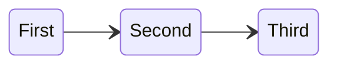

```
stateDiagram-v2
    direction LR
    First --> Second %% Here's a comment
    Second --> Third
    %% Here's another comment
```

# Flowcharts cheatsheet

[Official documentation](https://mermaid-js.github.io/mermaid/#/flowchart) & [live editor](https://mermaidjs.github.io/mermaid-live-editor/#/edit/eyJjb2RlIjoiZ3JhcGggVERcbiAgICBBW0hhcmRdIC0tPnxUZXh0fCBCKFJvdW5kKVxuICAgIEIgLS0-IEN7RGVjaXNpb259XG4gICAgQyAtLT58T25lfCBEW1Jlc3VsdCAxXVxuICAgIEMgLS0-fFR3b3wgRVtSZXN1bHQgMl0iLCJtZXJtYWlkIjp7InRoZW1lIjoiZGVmYXVsdCJ9fQ).

## Nodes

### Node styles

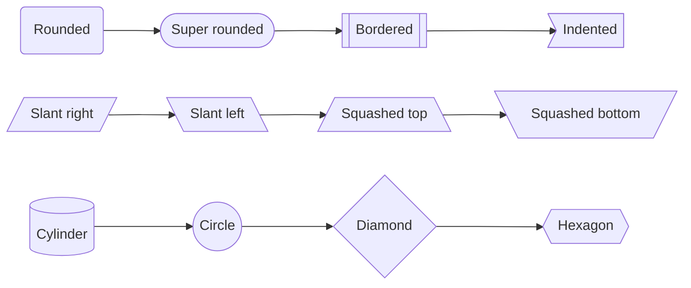

```
flowchart LR; 
    1(Rounded) --> 2([Super rounded]) --> 3[[Bordered]] --> 4>Indented]
    5[/Slant right/] --> 6[\Slant left\] --> 7[/Squashed top\] --> 8[\Squashed bottom/]
    9[(Cylinder)] --> 10((Circle)) --> 11{Diamond} --> 12{{Hexagon}}
```

### Node hyperlinks

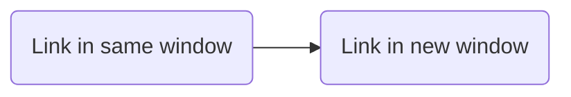

```
flowchart LR
    1(Link in same window) --> 2(Link in new window)
    click 1 "https://example.com" _self
    click 2 "https://example.com" _blank
```

*Note: It is possible
to [use JavaScript for more advanced actions](https://mermaid-js.github.io/mermaid/#/flowchart?id=interaction) than a
simple link.*

## Connections

### Connection styles

```mermaid
flowchart LR
    Basic --- 1[Basic with text] -- Text! --- End
    Dotted -.- 2[Dotted with text] -. Text! . - End 
    Thick === 3[Thick with text] == Text! === End
```

```
flowchart LR
    Basic --- 1[Basic with text] -- Text! --- End
    Dotted -.- 2[Dotted with text] -. Text! .- End
    Thick === 3[Thick with text] == Text! === End
```

### Connection types

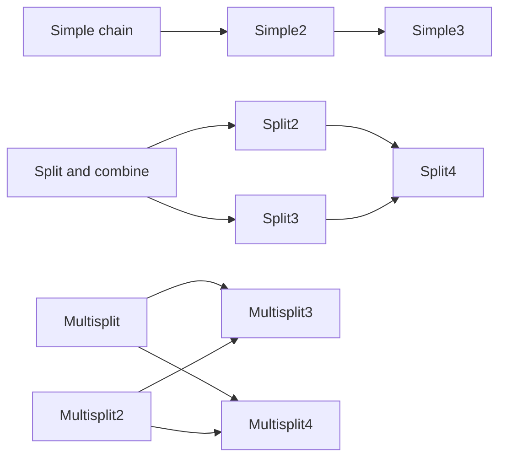

```
flowchart LR
    1[Simple chain] --> Simple2 --> Simple3
    2[Split and combine] --> Split2 & Split3 --> Split4
    3[Multisplit] & Multisplit2 --> Multisplit3 & Multisplit4
```

### Connection lengths

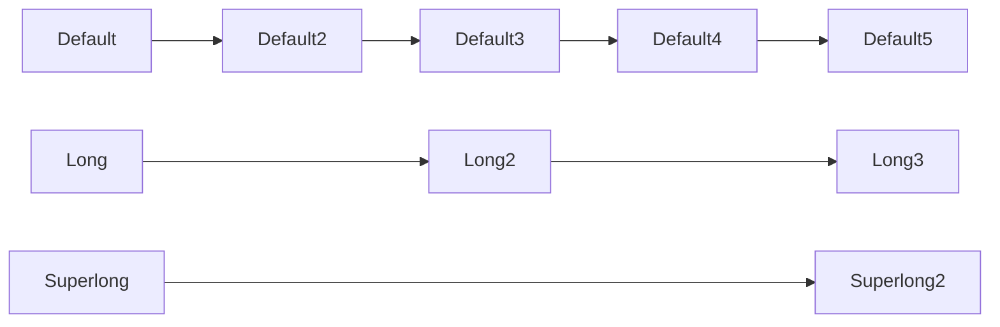

```
flowchart LR
    Default --> Default2 --> Default3 --> Default4 --> Default5
    Long ---> Long2 ---> Long3
    Superlong -----> Superlong2
```

### Arrow types

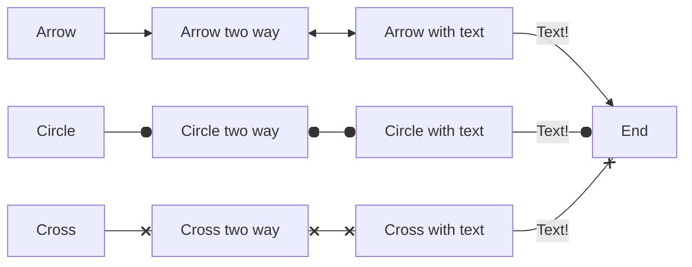

```
flowchart LR
    Arrow --> 1[Arrow two way] <--> 2[Arrow with text] -- Text! --> End
    Circle --o 3[Circle two way] o--o 4[Circle with text] -- Text! --o End
    Cross --x 5[Cross two way] x--x 6[Cross with text] -- Text! --x End
```

## Graphs

### Orientation

<table>
    <tr><td></td><td>Standard</td><td>Reversed</td></tr>
    <tr><td>Vertical</td>
<td>

**TB**: Top to Bottom<br>(also **TD**: Top down)

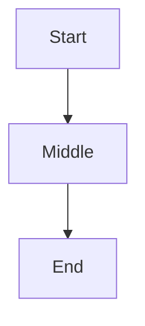

</td><td>

**BT**: Bottom to Top

```mermaid
flowchart BT
;
    Start --> Middle --> End
```

</td>
    </tr>
    <tr><td>Horizontal</td>
<td>

**LR**: Left to Right

```mermaid
flowchart LR
;
    Start --> Middle --> End
```

</td><td>

**RL**: Right to Left

```mermaid
flowchart RL
;
    Start --> Middle --> End
```

</td>
    </tr>
</table>

## Subgraphs

### Defining

```mermaid
flowchart TD
    subgraph a
        a1 --> a2
    end

    subgraph b
        b1 --> b2
    end

    subgraph c
        c1 --> c2
    end
```

### Defining

```mermaid
flowchart TD
    subgraph a
        a1 --> a2
    end

    subgraph b
        b1 --> b2
    end

    subgraph c
        c1 --> c2
    end
```

```
flowchart TD
    subgraph a
    a1 --> a2
    end

    subgraph b
    b1 --> b2
    end
    
    subgraph c
    c1 --> c2
    end
```

### Linking

```mermaid
flowchart LR
    subgraph a
        a1
        a2
    end

    subgraph b
        b1
        b2
    end

    subgraph c
        c1
        c2
    end

    a -- " Graph to graph " --> b
    c1 -- " Node to node " --> c2
    b1 -- " Node to graph " --> c
    c -- " Graph to node " --> a1
```

```
flowchart LR
    subgraph a
    a1
    a2 
    end

    subgraph b
    b1
    b2
    end
    
    subgraph c
    c1
    c2
    end

    a -- "Graph to graph" --> b
    c1 -- "Node to node" --> c2
    b1 -- "Node to graph" --> c
    c -- "Graph to node" --> a1
```

### Orientation

```mermaid
flowchart TD
    subgraph a
        direction TB
        a1 --> a2
    end

    subgraph b
        direction BT
        b1 --> b2
    end

    subgraph c
        direction LR
        c1 --> c2
    end

    subgraph d
        direction RL
        d1 --> d2
    end
```

```
flowchart TD
    subgraph a
    direction TB
    a1 --> a2
    end

    subgraph b
    direction BT
    b1 --> b2
    end
    
    subgraph c
    direction LR
    c1 --> c2
    end

    subgraph d
    direction RL
    d1 --> d2
    end

```

## Comments

```mermaid
flowchart LR
%% Comment here
    a1 --> a2
%% Also here
```

```
flowchart LR
    %% Comment here
    a1 --> a2
    %% Also here
```

## Styling

### Styling individual / groups of nodes

```mermaid
flowchart LR
    Individual1 --> Individual2 --> Individual3
    style Individual1 fill: #000, color: #fff, stroke: #333
    style Individual2 fill: #fff, color: #000, stroke: #999
    style Individual3 fill: #666, color: #f00, stroke: #0ff
    Batch1:::myclass --> Batch2:::myclass --> Batch3:::myclass
    classDef myclass fill: #571
```

```
flowchart LR
    Individual1 --> Individual2 --> Individual3
    style Individual1 fill:#000, color:#fff, stroke:#333
    style Individual2 fill:#fff, color:#000, stroke:#999
    style Individual3 fill:#666, color:#f00, stroke:#0ff

    Batch1:::myclass --> Batch2:::myclass --> Batch3:::myclass
    classDef myclass fill:#571
```

### Styling all nodes

```mermaid
flowchart LR
    Default1 --> Default2 --> Default3
    classDef default fill: #A77
```

```
flowchart LR
    Default1 --> Default2 --> Default3
    classDef default fill:#A77
```

# Class diagrams cheatsheet

[Official documentation](https://mermaid-js.github.io/mermaid/#/classDiagram) & [live editor](https://mermaidjs.github.io/mermaid-live-editor/#/edit/eyJjb2RlIjoiY2xhc3NEaWFncmFtXG5DbGFzczAxIDx8LS0gQXZlcnlMb25nQ2xhc3MgOiBDb29sXG48PGludGVyZmFjZT4-IENsYXNzMDFcbkNsYXNzMDkgLS0-IEMyIDogV2hlcmUgYW0gaT9cbkNsYXNzMDkgLS0qIEMzXG5DbGFzczA5IC0tfD4gQ2xhc3MwN1xuQ2xhc3MwNyA6IGVxdWFscygpXG5DbGFzczA3IDogT2JqZWN0W10gZWxlbWVudERhdGFcbkNsYXNzMDEgOiBzaXplKClcbkNsYXNzMDEgOiBpbnQgY2hpbXBcbkNsYXNzMDEgOiBpbnQgZ29yaWxsYVxuY2xhc3MgQ2xhc3MxMCB7XG4gID4-c2VydmljZT4-XG4gIGludCBpZFxuICBzaXplKClcbn0iLCJtZXJtYWlkIjp7InRoZW1lIjoiZGVmYXVsdCJ9fQ).

## Attribute / function defining

### Basic syntax

```mermaid
classDiagram
    class ClassName {
        String stringName
        Long longName
        MyDatatype attributeName
        functionName(parameter) ReturnType
        functionName2(parameter2) ReturnType
    }
```

```
classDiagram
    class ClassName {
        String stringName
        Long longName
        MyDatatype attributeName

        functionName(parameter) ReturnType
        functionName2(parameter2) ReturnType
    }
```

### Visibility

```mermaid
classDiagram
    class ClassName {
        +publicFunction()
        -privateFunction()
        #protectedFunction()
        ~ packageOrInternalFunction()
        abstractFunction()*
        staticFunction()*
    }
```

```
classDiagram
    class ClassName {
        +publicFunction()
        -privateFunction()
        #protectedFunction()
        ~packageOrInternalFunction()
        abstractFunction()*
        staticFunction()*
    }
```

### Generics

```mermaid
classDiagram
    class ClassName~MyType~ {
        List~MyType~ myList
        withParameter(List~MyType~)
        withReturnType() List~MyType~
    }
```

```
classDiagram
    class ClassName~MyType~ {
        List~MyType~ myList
        withParameter(List~MyType~)
        withReturnType() List~MyType~
    }
```

### Annotations

```mermaid
classDiagram
    class ClassName {
        <<annotation>>
        String stringName
        Long longName
        MyDatatype attributeName
    }
```

```
classDiagram
    class ClassName {
        <<annotation>>
        String stringName
        Long longName
        MyDatatype attributeName
    }
```

## Relationship defining

### Relationship

```mermaid
classDiagram
    direction LR
    classA --|> classB: Inheritance
    classB --* classC: Composition
    classC --o classD: Aggregation
    classD --> classE: Association
    classF -- classG: Link(Solid)
    classG ..> classH: Dependency
    classH ..|> classI: Realization
    classI .. classJ: Link(Dashed)
```

```
classDiagram
    direction LR
    classA --|> classB : Inheritance
    classB --* classC : Composition
    classC --o classD : Aggregation
    classD --> classE : Association
    classF -- classG : Link(Solid)
    classG ..> classH : Dependency
    classH ..|> classI : Realization
    classI .. classJ : Link(Dashed)
```

### Cardinality / multiplicity

```mermaid
classDiagram
Apple Tree "1" --> "0..*" Apple
Apple "1" --> "1..*" Seed
```

```
classDiagram
    Apple Tree "1" --> "0..*" Apple
    Apple "1" --> "1..*" Seed
```

## Other functionality

### Links

```mermaid
classDiagram
    class ClickableClass {
        String stringName
    }
    click ClickableClass href "https://example.com"
```

```
classDiagram
    class ClickableClass {
        String stringName
    } 
    click ClickableClass href "https://example.com"
```

*Note: It is possible
to [use JavaScript for more advanced actions](https://mermaid-js.github.io/mermaid/#/classDiagram?id=interaction) than a
simple link.*

### Comments

```mermaid
classDiagram
%% A comment is here
    class ClassName {
        String stringName
    }
%% And here
```

```
classDiagram
%% A comment is here
    class ClassName {
        String stringName
    } 
%% And here
```

### Styling

*Styling requires CSS, and is
defined [on the official documentation](https://mermaid-js.github.io/mermaid/#/classDiagram?id=styling).*
